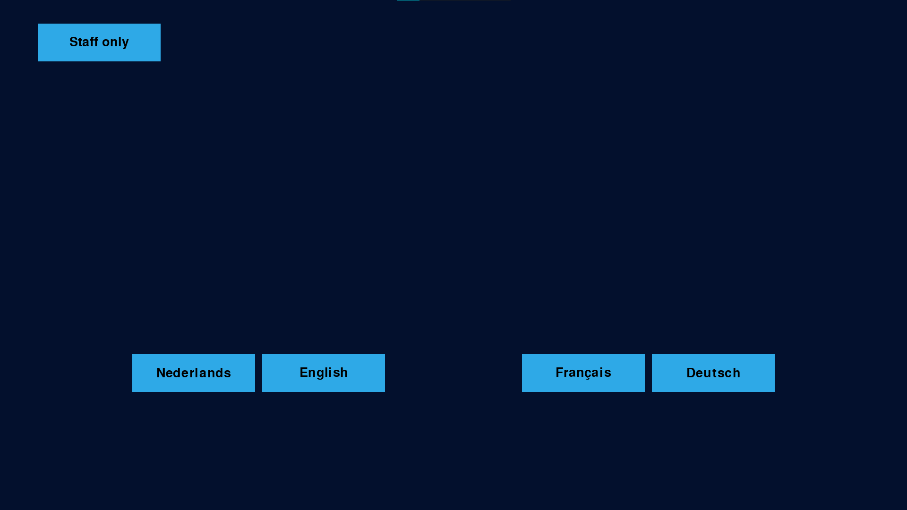
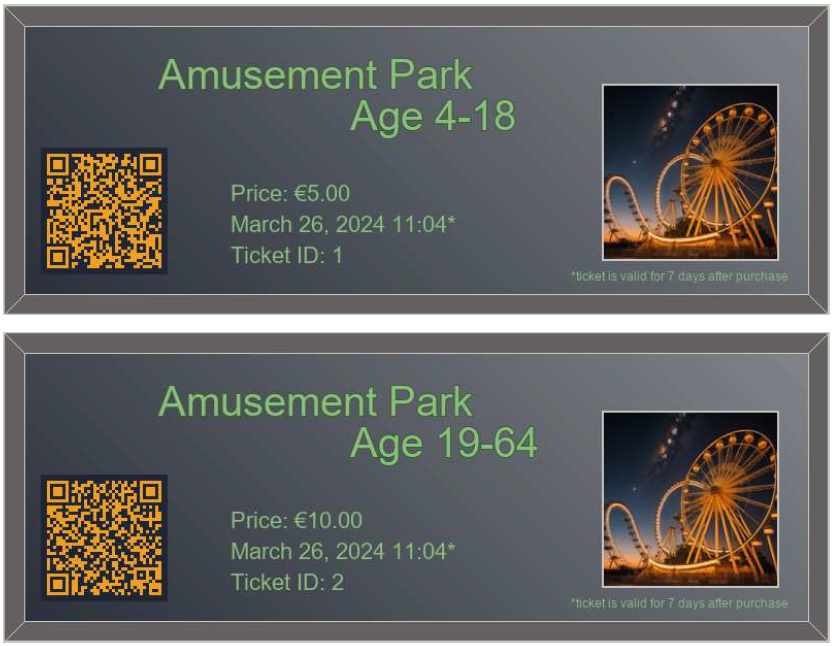
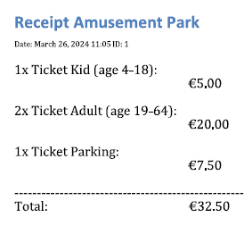

# Amusement Park

This project is an interface for a checkout system for amusement parks or similar places where ticket entry is required. \
I made this project for an assignment at school. The project is written entirely in Python and the frontend is done with the use of the pygame library.

### Contents

- [Features](#features)
  - [Additional requirements](#additional-requirements)
- [Installation](#installation)
- [Initial setup](#initial-setup)
- [Screenshots](#screenshots)
  - [interface](#interface)
  - [Example ticket](#example-tickets)
  - [Example receipt](#example-receipt)
- [Authors](#authors)
- [Acknowledgements](#acknowledgements)

## Features

- 4 supported languages
- Fullscreen mode
- Touchscreen support
- Generates tickets and prints them with default printer
- Option to print receipt as well
- Customizable park name en prizes
- Staff interface

## Installation

You can download the zip file found in [Releases](https://github.com/RixgamesGH/Amusement-park/releases). \
Then, unzip the file and make sure it's on the C drive. \
You now have a map with some files. You can run the program by starting the exe file.

#### Additional requirements
- Adobe Reader or Acrobat. Make sure you have this installed on your device's C drive.
- Microsoft Word

## Initial setup

The first time you start the file you'll be asked to enter a license code for PySimpleGUI. Simply copy the code from this [file](docs/PySimpleGUI-license).\
After that there will be some questions asked for the initial setup of the settings. It will ask for:
- The PIN to access the staff interface
- The name of the park
- The prizes for each age category
- Group discount information

All the information, except for the park name,  needs to be exclusively numbers, with optionally decimals (for example: 9.99)

## Usage

After the initial setup you can start using the program. When you start it up the first thing you'll see is [this interface](#interface).
For self-checkout, guests are able to choose the language they want. For cashiers having to select the language everytime might become annoying.
So for that you can go to "Staff only". You'll have to enter the PIN you set up initially to access this menu. After that there will be an option
to activate the "Cashier interface" as well as the options to close the app or change the settings from the initial setup.

If you wish to look at the ticket files made after having used the interface for a while, you can find these in the same folder where you have the
[exe file](#installation).

## Screenshots

#### interface

#### Example tickets

#### Example receipt

## Authors

- [@RixgamesGH](https://github.com/RixgamesGH)

## Acknowledgements

Some libraries I used that were very helpful for this project:
- [Pygame](https://github.com/pygame/pygame)
- [Printfactory](https://pypi.org/project/printfactory/)
- [PySimpleGUI](https://pypi.org/project/PySimpleGUI/)
- [Pillow](https://github.com/python-pillow/Pillow)
- [Qrcode](https://github.com/lincolnloop/python-qrcode)
- [Jinja](https://github.com/pallets/jinja/)
- [Docx](https://github.com/python-openxml/python-docx)
- [Docx2pdf](https://github.com/AlJohri/docx2pdf)
