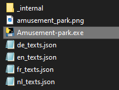

# Amusement Park

This project is an interphase for a checkout system for amusement parks or similar places where ticket entry is required. I made this project for an assignment at school. The project is written entirely in Python and the frontend is done with the use of the pygame library.

## Features

- 4 supported languages
- Fullscreen mode
- Touchscreen support
- Generates tickets and prints them with default printer
- Option to print receipt as well
- Customizable park name en prizes
- PIN locked staff section

## Installation

You can download the zip file found in [Releases](https://github.com/RixgamesGH/Amusement-park/releases). \
After having done this, unzip the file and make sure it's on the C drive. \
You now have a map with some files. You can run the program by starting the exe file. \

## Authors

- [@RixgamesGH](https://github.com/RixgamesGH)

